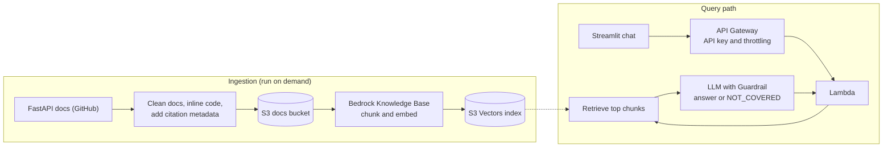

# Bedrock RAG Docs Assistant

A question-answering assistant for the [FastAPI documentation](https://fastapi.tiangolo.com), built on
Amazon Bedrock. Ask a question in plain English and get a short answer with links to the exact
documentation pages it came from, or a clear "not covered" reply when the docs don't contain the answer.

**What this project demonstrates**

- A complete retrieval-augmented generation (RAG) system on AWS: ingestion, vector search, generation, API, and UI.
- Everything defined as code with AWS CDK, so it deploys with one command and is removed with one command.
- Safety and cost controls: Bedrock Guardrails (content filters and prompt-attack blocking, with optional
  grounding checks), an explicit "not covered" path, and an API key with throttling and a daily quota.
- Measured quality: an evaluation harness with 60 test questions that reports retrieval accuracy, answer accuracy,
  citation accuracy, refusal accuracy, and latency, so design changes can be compared with numbers.

## Architecture



Design decisions, security and cost controls, and known limitations are in
[docs/architecture.md](docs/architecture.md).

## Quick start

**Prerequisites:** an AWS account with credentials configured, access to Amazon Titan Text Embeddings V2 and
Amazon Nova Lite in your Bedrock console, Python 3.12+, and Node.js (for the CDK command-line tool).

```bash
python -m venv .venv && source .venv/bin/activate
pip install -r requirements.txt -r infra/requirements.txt
npm install -g aws-cdk

# 1. Deploy the infrastructure
cd infra
cdk bootstrap          # once per AWS account and region
cdk deploy
cd ..

# 2. Download, prepare, and index the docs
python -m ingestion.ingest

# 3. Run the chat page
aws apigateway get-api-key --api-key <ApiKeyId from the deploy output> --include-value --query value --output text
export DOCS_ASSISTANT_API_URL="<ApiUrl from the deploy output>"
export DOCS_ASSISTANT_API_KEY="<the key value>"
streamlit run app/streamlit_app.py
```

Preview the ingestion without touching AWS with `python -m ingestion.ingest --dry-run`.
Alternatively, put the two settings in `.streamlit/secrets.toml` (see `.streamlit/secrets.toml.example`).

## Evaluation

```bash
python -m eval.run_eval --check-questions                    # confirm the test questions match your docs
python -m eval.run_eval --label fixed-300-20 --judge         # full run, with an LLM judge
python -m eval.run_eval --retrieval-only --label retrieval   # cheap retrieval-only run
python -m eval.compare eval/results/<run-a>/summary.json eval/results/<run-b>/summary.json
```

The test set (`eval/questions.jsonl`) has 48 answerable questions, each with the page it should come from,
key terms the answer should contain, and a reference answer, plus 12 unanswerable questions (off-topic and
prompt-injection attempts) that the assistant should decline. Each run writes `summary.json`, `records.jsonl`,
and `report.md` under `eval/results/`, including the list of questions that failed and why.

To compare chunking settings, redeploy with different values (see Configuration), re-run ingestion, and run the
evaluation with a matching `--label`.

### Results

Two runs of the same 60 questions against the same index and model (Amazon Nova Lite, Titan Text Embeddings V2,
300-token chunks), differing only in the Guardrail's contextual grounding checks:

| Metric | Grounding 0.5 + relevance 0.3 | Grounding checks off |
|---|---|---|
| Retrieval hit rate (answerable) | 100.0% | 100.0% |
| Mean reciprocal rank | 0.94 | 0.94 |
| Answer accuracy (keywords) | 70.8% | 97.9% |
| Answer accuracy (LLM judge) | 60.4% | 85.4% |
| Citation hit rate (answered) | 100.0% | 97.9% |
| Answers with sources | 100.0% | 100.0% |
| False refusals (answerable) | 29.2% | 0.0% |
| Correct refusals (unanswerable) | 100.0% | 100.0% |
| Answered when it should refuse | 0.0% | 0.0% |
| Latency p50 / p95 | 3.03s / 5.65s | 2.81s / 4.90s |

**What this showed.** Retrieval was already perfect, so the low first-run accuracy was not a search problem. All 14
wrongly refused questions were blocked by the Guardrail, not by the model, and switching the grounding checks off
removed every false refusal while the prompt's `NOT_COVERED` instruction still declined all 12 off-topic and
prompt-injection questions. The deployed default is therefore checks off.

**Caveats.** The 12 unanswerable questions are off-topic or injection attempts. They do not test an on-topic
question the docs happen to leave unanswered, which is where grounding checks help most, and with them off nothing
independent verifies the model's claims against the retrieved text. The judge is Nova Lite grading its own style of
answer. Sixty questions are enough to see a 30-point change but not small differences. A middle threshold (for example
grounding 0.3) was not evaluated. Run it with `cdk deploy -c grounding_threshold=0.3 -c relevance_threshold=off`.

## Project layout

| Folder | Purpose |
|---|---|
| `infra/` | AWS CDK (Python) stack: S3, S3 Vectors, Bedrock Knowledge Base, Guardrail, Lambda, API Gateway |
| `ingestion/` | Fetches the docs, inlines code samples, adds citation metadata, uploads to S3, syncs the Knowledge Base |
| `lambda_api/` | Lambda handler and the shared RAG logic (`rag.py`) used by both the API and the evaluation |
| `app/` | Streamlit chat interface and its API client |
| `eval/` | Question set, scoring, optional LLM judge, run comparison |
| `tests/` | Unit tests; none need AWS credentials |

## Configuration

Set at deploy time with CDK context, for example `cdk deploy -c chunk_max_tokens=500`:

| Setting | Default | Notes |
|---|---|---|
| `embedding_model_id` | `amazon.titan-embed-text-v2:0` | The stack uses 1024-dimension vectors; the model must support that |
| `generation_model_id` | `us.amazon.nova-lite-v1:0` | Any Bedrock text model you have access to |
| `chunk_max_tokens` | `300` | Fixed-size chunking |
| `chunk_overlap_pct` | `20` | Overlap between chunks |
| `grounding_threshold` | off | Guardrail grounding check (0 to 1; higher blocks more). Off by default, see Results |
| `relevance_threshold` | off | Guardrail relevance check (0 to 1; higher blocks more). Off by default, see Results |

The region comes from `CDK_DEFAULT_REGION` (default `us-east-1`).

## Testing and CI

```bash
pip install -r requirements.txt -r infra/requirements.txt ruff
ruff check .
python -m pytest -q
```

The tests cover the CDK template, the document preparation, the Lambda logic (against a fake Bedrock client and the
real AWS API schema), the chat page, and the evaluation scoring. GitHub Actions runs lint and tests on every push
and pull request (`.github/workflows/ci.yml`).

## Cost and cleanup

Costs come from embedding documents at ingestion time, vector storage and queries in S3 Vectors, model tokens and
Guardrail usage for each question, and, at demo scale, very little for Lambda and API Gateway. Unlike a dedicated
vector database, S3 Vectors has no always-on instance charge. The API's usage plan caps traffic at 5 requests per
second and 1,000 requests per day. Check the current AWS pricing pages for exact figures.

Remove everything with:

```bash
cd infra && cdk destroy
```

## Limitations

English docs only; fixed-size chunking with no reranking; the API key is a shared secret, not per-user
authentication; evaluation uses a modest question set and keyword matching unless the LLM judge is enabled.
See [docs/architecture.md](docs/architecture.md) for details and ideas for next steps.